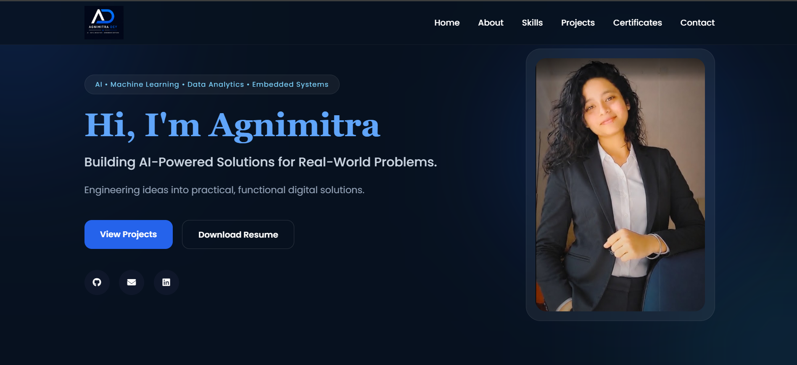

# 🌐 Personal Portfolio — Agnimitra Dey

> A modern, responsive personal portfolio website showcasing my skills, projects, certifications, and learning journey in **AI, Machine Learning, Data Analytics, and Software Development**.

---

## 🚀 Live Website

🔗 **[Visit My Portfolio](https://debraniprl-wq.github.io/agnimitra-portfolio/)**

---

## 🖥️ Preview



---

## ✨ Features

* 🎨 Clean and modern responsive design
* 📱 Mobile-friendly navigation
* 👩‍💻 About Me section
* 🛠️ Skills & technologies
* 🚀 Featured projects with live demos
* 📜 Certifications & achievements
* 📧 Contact section
* 🔗 GitHub and LinkedIn integration
* 📄 Resume access
* ⚡ Smooth scrolling and interactive UI

---

## 📂 Sections

### 👤 About Me

A brief introduction highlighting my background, interests, and current learning journey.

### 🛠️ Skills

Technologies and tools I work with, including programming, web development, AI/ML, data analytics, and development tools.

### 🚀 Projects

A selection of my featured projects, with links to their live demos and source code.

### 📜 Certifications

Selected certifications and achievements from platforms and organizations such as NASA, ISRO, Google, Tata, Deloitte, IEEE, and TCS.

### 📬 Contact

Links to connect with me through email, GitHub, and LinkedIn.

---

## 🧰 Technologies Used

* **HTML5**
* **CSS3**
* **JavaScript**
* **Font Awesome**
* **Git & GitHub**
* **GitHub Pages**

---

## 📁 Project Structure

```text
agnimitra-portfolio/
│
├── index.html
├── style.css
├── script.js
│
└── assets/
    ├── portfolio-preview.png
    ├── logo.png
    ├── profile.png
    ├── project1.png
    ├── project2.png
    ├── project3.png
    ├── project4.png
    ├── resume.jpeg
    └── certificates...
```

---

## 📌 Featured Projects

Some of the projects showcased in this portfolio include:

* **AI Resume Screener** — AI-powered resume analysis and candidate screening platform.
* **NeuroDesk** — AI-powered productivity workspace for intelligent workflows.
* **AgencyFlow CRM** — CRM platform for lead management and sales workflows.
* **ForecastIQ** — Data-driven forecasting platform for business insights.

More projects are available on my GitHub profile.

---

## 🎓 Certifications & Learning

The portfolio features selected certifications and achievements related to:

* Artificial Intelligence
* Machine Learning
* Data Analytics
* Technology
* VLSI & IC Design
* Open Science
* Space & Science

More certifications and achievements will be added as I continue learning.

---

## 🌱 Currently Learning

* Artificial Intelligence
* Machine Learning
* Data Analytics
* Software Development
* Embedded Systems

---

## 📈 Future Improvements

* Add more projects and certifications
* Continue improving UI/UX
* Add new interactive features
* Expand the portfolio with future learning and development work

---

## 👩‍💻 Author

### Agnimitra Dey

B.Tech ECE Student | AI & ML | Data Analytics | Software Development

🔗 **GitHub:** [debraniprl-wq](https://github.com/debraniprl-wq)

🔗 **LinkedIn:** [Agnimitra Dey](https://www.linkedin.com/in/agnimitra-dey-97312237a/)

📧 **Email:** [debrani.prl@gmail.com](mailto:debrani.prl@gmail.com)

---

⭐ If you find this portfolio interesting, feel free to explore the projects and connect with me.
